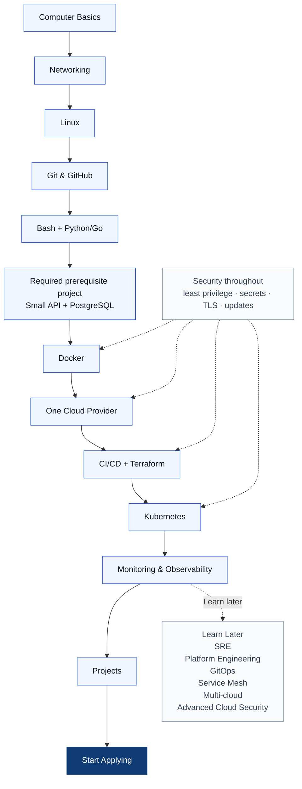

# Main roadmap

Move forward when you can explain the previous stage and finish its small lab. Do not wait for perfection before projects or applications.

## Milestones

1. **Foundation:** finish computer, networking, Linux, Git, and scripting; run Project 1.
2. **Required application context:** after scripting, use [prerequisites.md](prerequisites.md) to build Project 2. Learn what you deploy, without becoming a backend developer or DBA.
3. **Delivery:** containerize the application first, deploy that Dockerized application to one cloud, automate it, and provision it with Terraform (Projects 3–6).
4. **Operations:** deploy the same app to Kubernetes and observe it (Projects 7–8).

Start applying once you can confidently demo Projects 3–6 **and** meet the minimum Kubernetes/operations baseline: deploy a simple app, inspect it with `kubectl get`, `describe`, and `logs`, read a basic dashboard, and protect secrets. This is working knowledge, not Kubernetes mastery. Projects 7–8 make the portfolio stronger while you apply. See [HOW-TO-FOLLOW-THE-ROADMAP.md](HOW-TO-FOLLOW-THE-ROADMAP.md) for stage-by-stage readiness checks.

## Learn Later

These are valuable, but not first-job requirements: advanced OS internals; distributed systems; multi-cloud; service mesh; Kubernetes Operators; eBPF; advanced GitOps; Platform Engineering; Internal Developer Platforms; advanced SRE and error budgets; advanced cloud security; FinOps; BGP; and complex microservices architecture.
