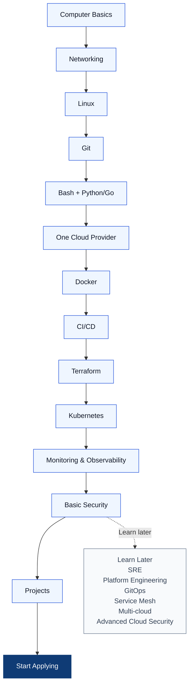

# Main roadmap

Move forward when you can explain the previous stage and finish its small lab. Do not wait for perfection before projects or applications.

## Milestones

1. **Foundation:** finish computer, networking, Linux, Git, and scripting; run Project 1.
2. **Just enough application context:** use [prerequisites.md](prerequisites.md) while building Project 2. Learn what you deploy, without becoming a backend developer or DBA.
3. **Delivery:** containerize it, deploy it to one cloud, automate it, and provision it with Terraform (Projects 3–6).
4. **Operations:** deploy the same app to Kubernetes and observe it (Projects 7–8).

You can apply once the checklist is substantially true and you can confidently demo Projects 3–6. Kubernetes and monitoring make the portfolio stronger; they are not a reason to delay a junior application. See [HOW-TO-FOLLOW-THE-ROADMAP.md](HOW-TO-FOLLOW-THE-ROADMAP.md) for stage-by-stage readiness checks.

## Learn Later

These are valuable, but not first-job requirements: advanced OS internals; distributed systems; multi-cloud; service mesh; Kubernetes Operators; eBPF; advanced GitOps; Platform Engineering; Internal Developer Platforms; advanced SRE and error budgets; advanced cloud security; FinOps; BGP; and complex microservices architecture.
