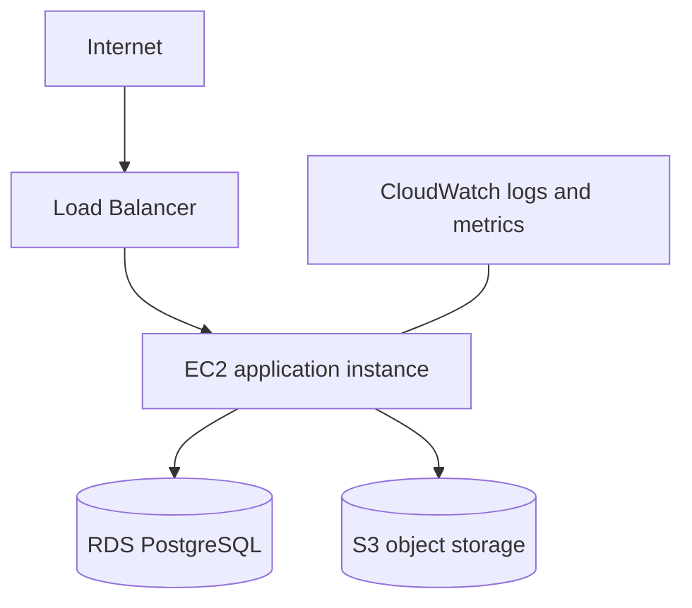

# Cloud architecture

```mermaid
flowchart TD
 I[Internet] --> ALB[Load Balancer]
 ALB --> EC2[EC2 application instance]
 EC2 --> RDS[(RDS PostgreSQL)]
 EC2 --> S3[(S3 object storage)]
 CW[CloudWatch logs and metrics] --- EC2
```
