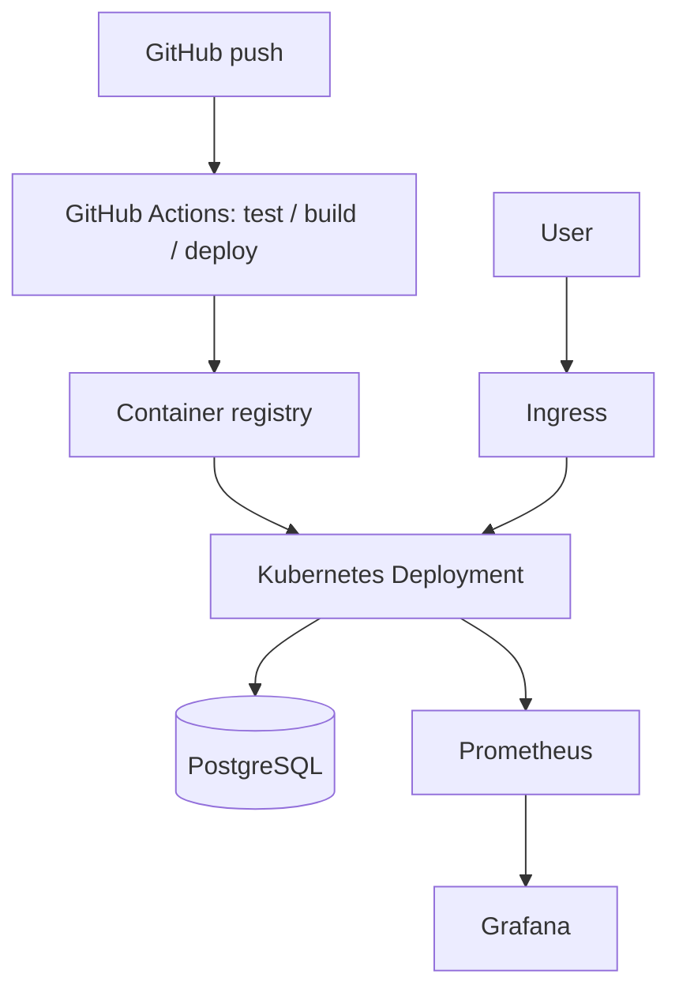

# Final project architecture

```mermaid
flowchart TD
 G[GitHub push] --> A[GitHub Actions: test / build / deploy]
 A --> R[Container registry]
 R --> K[Kubernetes Deployment]
 U[User] --> I[Ingress]
 I --> K
 K --> P[(PostgreSQL)]
 K --> M[Prometheus] --> F[Grafana]
```
