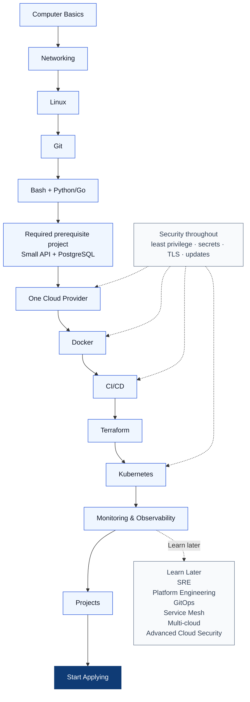

# Roadmap diagram

```mermaid
flowchart TD
    Computer[Computer Basics] --> Networking[Networking]
    Networking --> Linux[Linux]
    Linux --> Git[Git]
    Git --> Automation[Bash + Python/Go]
    Automation --> Prerequisite[Required prerequisite project<br/>Small API + PostgreSQL]
    Prerequisite --> Cloud[One Cloud Provider]
    Cloud --> Docker[Docker]
    Docker --> CICD[CI/CD]
    CICD --> Terraform[Terraform]
    Terraform --> Kubernetes[Kubernetes]
    Kubernetes --> Observability[Monitoring & Observability]
    Observability --> Projects[Projects]
    Projects --> Applying[Start Applying]

    Security[Security throughout<br/>least privilege · secrets · TLS · updates] -.-> Cloud
    Security -.-> Docker
    Security -.-> CICD
    Security -.-> Kubernetes

    Observability -. Learn later .-> Later[Learn Later<br/>SRE<br/>Platform Engineering<br/>GitOps<br/>Service Mesh<br/>Multi-cloud<br/>Advanced Cloud Security]

    classDef main fill:#eff6ff,stroke:#1d4ed8,color:#0f172a,stroke-width:1px;
    classDef final fill:#0f3b75,stroke:#0f3b75,color:#ffffff,stroke-width:1px;
    classDef later fill:#f8fafc,stroke:#64748b,color:#334155,stroke-width:1px;
    class Computer,Networking,Linux,Git,Automation,Prerequisite,Cloud,Docker,CICD,Terraform,Kubernetes,Observability,Projects main;
    class Applying final;
    class Later,Security later;
```
