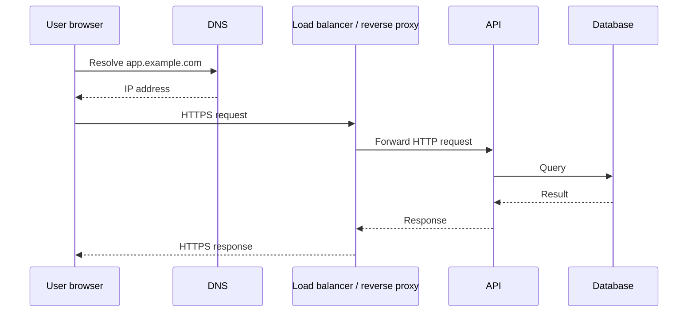

# Web request flow

```mermaid
sequenceDiagram
 participant U as User browser
 participant D as DNS
 participant L as Load balancer / reverse proxy
 participant A as API
 participant DB as Database
 U->>D: Resolve app.example.com
 D-->>U: IP address
 U->>L: HTTPS request
 L->>A: Forward HTTP request
 A->>DB: Query
 DB-->>A: Result
 A-->>L: Response
 L-->>U: HTTPS response
```
