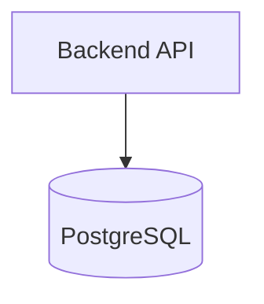

# Useful prerequisites: build what you deploy

This is helpful background, not a separate career track. **You do not need to be a backend developer or DBA, but you should understand basic backend flow and basic database design and have built a small project yourself.**

Read this after Linux and Git, alongside Bash/Python. Complete the project before moving into Docker and cloud deployment.

## Backend basics

| Topic | Enough for this roadmap |
|---|---|
| Client/server | A client sends a request; a server processes it and returns a response. |
| HTTP request/response | Know the URL, method, headers, body, and common status codes. |
| REST APIs | Recognize endpoints such as `GET /users` and `POST /users`. |
| JSON | Read and send simple objects and arrays in API requests/responses. |
| Auth basics | Authentication identifies a user/service; authorization decides what it may do. |
| Environment variables | Keep configuration such as `PORT` and `DATABASE_URL` outside source code. |
| Application ports | An app listens on a port; a proxy/load balancer must forward to the correct port. |
| Logging | Logs record requests and errors; never write secrets into them. |
| Health checks | A `/health` endpoint lets a platform check whether an app can serve traffic. |

## Database basics

| Topic | Enough for this roadmap |
|---|---|
| Tables and rows | A table stores related records; each row is one record. |
| Primary keys | A primary key uniquely identifies a row. |
| Foreign keys | A foreign key links rows in related tables. |
| Simple relationships | Model a one-to-many relationship, such as one user with many tasks. |
| Basic design | Give each table one clear purpose and choose stable identifiers. |
| CRUD | Create, read, update, and delete records with simple SQL. |
| Indexes | An index can speed up lookups but costs storage and write work. |
| Transactions | A transaction groups changes so they succeed or fail together. |

## Required hands-on project

Build a small backend in Python, Node.js, Go, or .NET. The language does not matter. It must:

- Create a few API endpoints.
- Connect to PostgreSQL using environment variables.
- Create a simple schema with primary and foreign keys, such as `users` and `tasks`.
- Perform CRUD operations through the API.
- Add request/error logging and `GET /health`.
- Test the API with `curl` or Postman.
- Explain how one API request reads or writes data in PostgreSQL.

Keep it small. The goal is to understand the backend-to-database path before you containerize, deploy, and operate it.

## What you do not need now

You do not need a full backend course, advanced framework design, microservices, database tuning, replication setup, or DBA work. Use the deeper [API guide](docs/06-backend-api-basics.md) and [database guide](docs/07-database-basics.md) only when needed.

## Completion checklist

- [ ] I can explain client/server, HTTP, REST, JSON, auth basics, ports, logs, and health checks.
- [ ] I can explain tables, rows, primary/foreign keys, simple relationships, CRUD, indexes, and transactions.
- [ ] I built and ran a small API connected to PostgreSQL myself.
- [ ] I created a simple related schema and used the API to perform CRUD.
- [ ] I can explain how the backend reads from and writes to the database.
