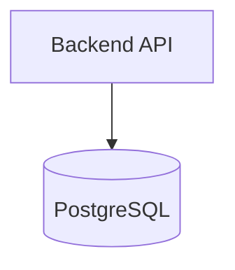

# Useful prerequisites: build what you deploy

This is helpful application background, not a second career roadmap. You do not need to become a backend developer or DBA, but you should have written and run a small backend application with a real database yourself.

Read this after Linux and Git, alongside Bash/Python. Complete the small project below before moving into Docker and cloud deployment.

## Simple theory to know

| Topic | Enough for this roadmap |
|---|---|
| Client/server | A client sends a request; a server processes it and returns a response. |
| HTTP request/response | Know URL, method, headers, body, and status codes such as 200, 404, and 500. |
| REST APIs | Recognize endpoints such as `GET /users` and `POST /users`. |
| JSON | Read and send simple objects and arrays in API requests/responses. |
| Authentication vs authorization | Authentication identifies a user/service; authorization decides what it may do. |
| Environment variables | Keep configuration such as `PORT` and `DATABASE_URL` outside source code. |
| Application ports | An app listens on a port; a proxy/load balancer must forward to the correct port. |
| Logging | Logs record requests and errors; never write secrets into them. |
| Health checks | A `/health` endpoint lets a platform check whether an app can serve traffic. |
| SQL basics | Use simple SQL to create, read, update, and delete data. |
| Tables and primary keys | A table stores rows; a primary key uniquely identifies each row. |
| Redis/cache basics | Redis can hold temporary cached values or sessions. A TTL is an expiry time; cache data is not automatically durable. |

## Required hands-on project

Build a tiny backend in Python, Node.js, Go, or .NET. The language does not matter. It must:

- Create a few REST endpoints, such as `GET /users`, `POST /users`, `PATCH /users/{id}`, and `DELETE /users/{id}`.
- Connect to PostgreSQL.
- Perform basic CRUD: create, read, update, and delete records.
- Read its port and database connection from environment variables.
- Add useful request/error logging.
- Expose `GET /health`.
- Be tested with `curl` or Postman.
- Be tested once with PostgreSQL stopped; inspect how the backend fails and logs the database error.

Keep it small. The goal is to understand the application path before you containerize, deploy, and operate it.

## What you do not need now

You do not need a full backend course, advanced framework design, microservices, database tuning, replication setup, or DBA work. Use the deeper [API guide](docs/06-backend-api-basics.md) and [database guide](docs/07-database-basics.md) only when needed.

## Completion checklist

- [ ] I can explain client/server, HTTP, REST, JSON, auth versus authorization, ports, logs, health checks, and basic SQL.
- [ ] I can explain tables, primary keys, CRUD, and what a cache/TTL is.
- [ ] I built and ran a small backend API connected to PostgreSQL myself.
- [ ] I used environment variables, logging, and a `/health` endpoint in that project.
- [ ] I tested CRUD with `curl` or Postman and observed a database failure in the logs.
